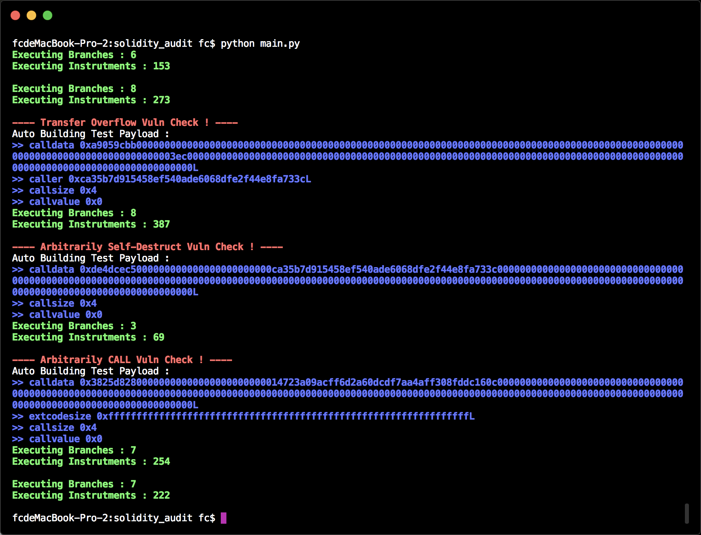

## Solidity 符号执行工具

  使用静态符号执行实现无输入分析各分支结构并推断各分支条件是否有解,最后根据策略分析合约漏洞并自动生成Payload .


## 效果




## 策略原理

  策略原理是**对操作数设定漏洞触发条件,然后放入z3 求解是否有解** ,示例代码如下：

```python

class vuln_checker :

    @staticmethod
    def transfer_overflow_check(state_object,address_object,check_object) :
    	#  address_object 是sstore 目的地址,check_object 是检查的数据
        check_result = False

        if  not opcode_express.is_take_input(address_object) and \
            not opcode_express.is_input(address_object) :  #  如果输入地址可控
            return False

        import z3

        z3_init_list = opcode_express.make_z3_init()  #  初始化z3 要求解对象

        for init_index in z3_init_list :
            exec(init_index)  #  callsize = z3.BitVec('callsize',opcode_express.opcode_call_size.LENGTH * 8)

        solver = z3.Solver()

        for express_index in state_object.express_list :  #  添加历史条件到求解器
            express_data = express_index.make_express()

            exec('solver.add(%s)' % (express_data))

        if not opcode_express.is_take_input(check_object) :  #  如果check_object 不可控,那就直接计算最后的结果能否小于0
            condition_value = execute_real_express(check_object)
        else :
            address_express = address_object.make_express()  #  生成z3 表达式
            check_express = check_object.make_express()

            exec('solver.add((%s) == %s)' % (address_express,opcode_express.DEFAULT_INPUT_ADDRESS))  #  求解地址能否可控
            exec('solver.add(%s < 0)' % (check_express))                                             #  求解对象能否下溢

            if z3.sat == solver.check() :  #  有解
                print '\033[1;31m---- Transfer Overflow Vuln Check ! ----\033[0m'  #  显示报告
                print 'Auto Building Test Payload :'

                check_result = True
                model_data = solver.model()  #  获取Payload 的解

                for key_index in model_data :
                    print '\033[1;34m>>',key_index,hex(int(str(model_data[key_index]))),'\033[0m'

        return check_result


```

